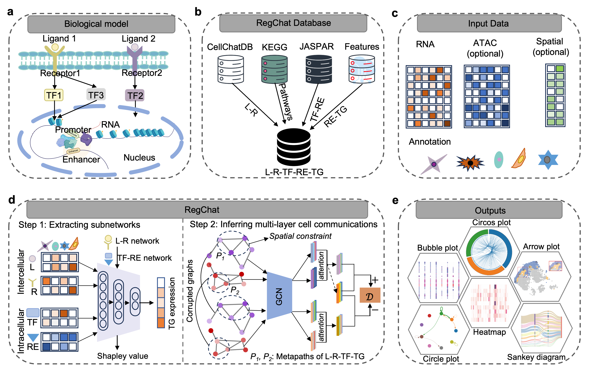

# RegChat v1.0.0 

# Cell-cell communication inference of multi-omics single-cell data

### Caiwei Zhen, ..., Lihua Zhang*


RegChat is a computational method, which perform Multi-layer network Inference based on Multi-Omics single-cell datasets through graph-regularized neural network and heterogenous graph attention neural network.



## Requirements and Installation
### Installation of RegChat

[](https://pypi.org/project/anndata/0.10.6/)
[](https://pypi.org/project/h5py/3.7.0/)
[](https://download.pytorch.org/whl/rocm5.6/)
[](https://pypi.org/project/jupyterlab/3.5.3/)
[](https://pypi.org/project/matplotlib/3.7.0/)
[](https://pypi.org/project/numpy/1.24.4/)
[](https://pypi.org/project/pandas/1.5.3/)
[](https://pypi.org/project/scikit-learn/1.2.1/)
[](https://pypi.org/project/scipy/1.10.1/)
[](https://pypi.org/project/scanpy/1.9.6/)
[](https://pypi.org/project/scikit-misc/0.5.1/)

```
# We recommend using Anaconda, and then you can create a new environment.
# Create and activate Python environment
conda create -n regchat python=3.10
conda activate regchat
# Installation of RegChat
pip install regchat
```
## Tutorials

We have applied RegChat on datasets, here we give step-by-step tutorials for Simulation data application scenarios. And preprocessed datasets used can be downloaded from [Google Drive](https://drive.google.com/drive/folders/19h9z2ac-mLrL2B2YuFGmCphuXb4vaEE_).


* [Multi-layer network inference of Simulation data](Tutorial/Simudata.ipynb)
* [Visual demonstration 1 of Simulation data](Tutorial/Visual_Simudata.ipynb)
* [Visual demonstration 2 of Simulation data](Tutorial/Visual_Simudata.R)

## About
Should you have any questions, please feel free to contact the author of the manuscript, Miss. Caiwei Zhen (cwzhen@whu.edu.cn).

## References
